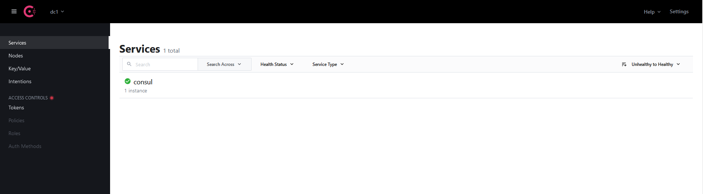

# Consul

## Mode mono-instance 

### Lancement du conteneur avec l'instance Consul

Pour lancer Consul, il suffit de lancer le conteneur avec le fichier docker-compose.

```
docker compose -f dc-consul-single.yml up -d
```

Si vous pointez votre navigateur sur `http://localhost:8500` ou sur `http://localhost:8500/ui` vous devriez être redirigés vers `http://localhost:8500/ui/dc1/services` et avoir un affichage similaire à ce qui suit.



### Arrêt du conteneur

Pour arrêter le conteneur :

```
docker compose -f dc-consul-single.yml down
```

## Mode cluster

**TODO**

## Ressources

Depuis [le site officiel de Consul](https://www.consul.io/) on peut accéder à des [tutoriaux](https://learn.hashicorp.com/consul) et à la [documentation de référence](https://www.consul.io/docs).