# Simple Docker Compose for a local Dependency Track instance

I have created [a small project on GitHub](https://github.com/TGITS/docker-compose-examples/tree/main/dependency-track-docker-compose-examples) that provides a docker compose file and a basic directory structure to have a local development environment with a [Dependency Track](https://dependencytrack.org/).
Do not use this directly in a production environment or at your own risk, this is really only for a local use.
It is partially based on the [docker compose file provided by Dependency Track](https://dependencytrack.org/docker-compose.yml) as [provided in the official documentation](https://docs.dependencytrack.org/getting-started/deploy-docker/).

Three applications are provided by the _docker compose file_:

* [Dependency Track](https://dependencytrack.org/), the _frontend_ and the _api server_.
* A [PostgreSQL](https://www.postgresql.org/) single instance used by the Dependency Track backend _api server_.
* The source security scanner [Trivy](https://trivy.dev/latest/) which is used by Dependency Track.

This project has been developed and tested under Windows 11 Professional with [Docker](https://www.docker.com/) and [Rancher Desktop](https://rancherdesktop.io/). However it should work on Windows, MacOs and Linux, with directly [Docker](https://www.docker.com/) or [Docker Desktop](https://www.docker.com/products/docker-desktop/).

In all cases you need to have a container engine compatible with `docker` and `docker compose` available on the command line.

Why using Postgresql as the database backing dependency track and not say MySQL or SQLserver ? 
This is because it is the [recommended database for Dependency Track](https://docs.dependencytrack.org/getting-started/database-support/) at the time of writing this README file. As a matter of fact the officialy provided docker compose file also uses PostgreSQL.

So, why creating my own version of the _docker compose file_ ?
I like to have a catalog of my docker compose files, ready to be used within a predefined directory structure.
Doing it for myself, why not share it with the hope it can be useful to somebody else ?
Furthermore in this particular case, I wanted to add a [Trivy Server](https://trivy.dev/) in the docker compose file.

As a matter of fact, the details of the directory structure is explained in the following schemas :

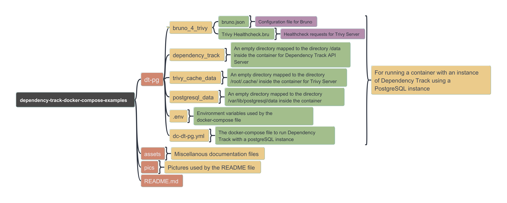

## Running the container with Dependency Track

To run the containers and have Dependency Track running using `docker compose`, open a shell on your computer go to the `dependency-track-docker-compose-examples/dt-pg` directory and run the following

```txt
docker compose -f dc-dt-pg.yml up -d
```

If your are on Windows, you can use WSL or if you have the docker engine installed (via Docker Desktop or Rancher Desktop) you can use Windows Powershell.

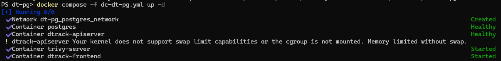

The `.env` file defines the  environment variables used in the docker compose file `dc-dt-pg.yml` for **PostgreSQL** and **Trivy** : on one hand you have `POSTGRES_DB`, `POSTGRES_USER`, `POSTGRES_PASSWORD`, which respectively corresponds to the name of a PostgreSQL database, the name of the user of this database and the password of this user and on the other hand `TRIVY_SERVER_TOKEN` which is used to authenticate to the Trivy Server.

## Accessing Dependency Track

When the containers are up and runnning, the Dependency Track Web Interface will be accessible on `http://localhost:8080/`.
The first time you access to Dependency Track, you will be prompted to change the default password for the user `admin`. 
As indicated in the [official documentation](https://docs.dependencytrack.org/getting-started/initial-startup/) the initial default password is also `admin`.

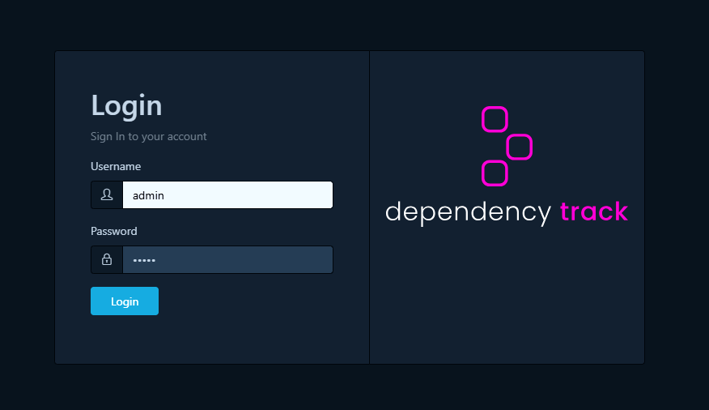

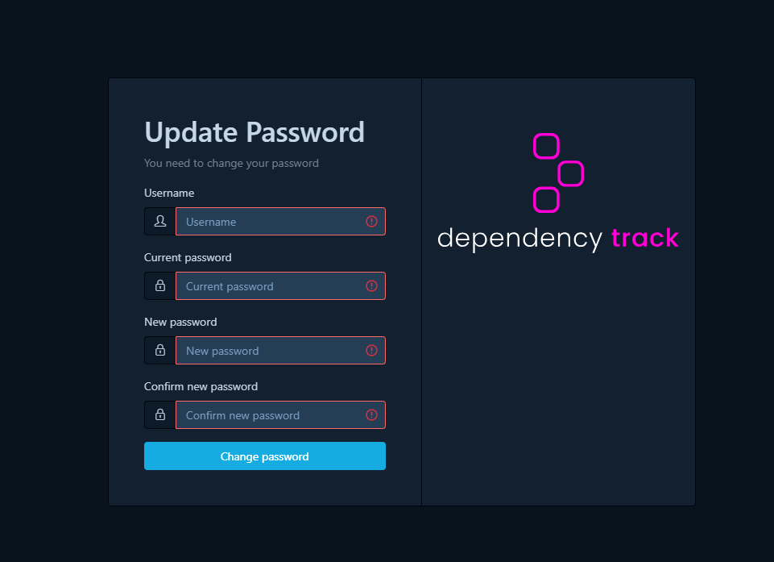

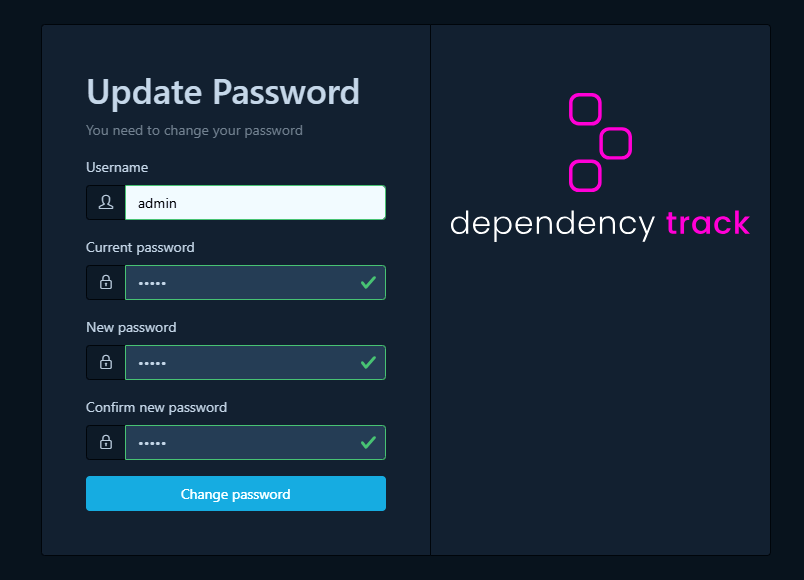

After changing the password, you will return on the login page where you will be able to use your new password to log in.


## Stopping the container

To stop the container, type the following in your shell, from the directory which contains the docker compose file `dc-dt-pg.yml` :

```txt
docker compose -f dc-dt-pg.yml down
```

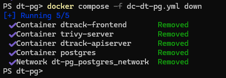

## Configuring Dependency Track

The Dependency Track container can be configured using any of the available configuration properties defined in: https://docs.dependencytrack.org/getting-started/configuration/
All properties are upper case with periods replaced by underscores.

There is much you can configure in DependencyTrack. However, DependencyTrack as a sensible default configuration for in a local environment. As such in this part we will not be exhaustive and only focus on the parts of the configuration pertaining to the analyzers and the vulnerability sourcers. 

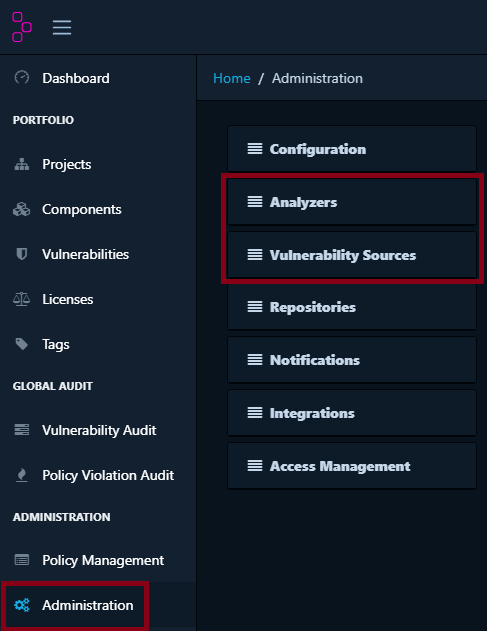

The configuration of the analyzer thereafter is optional, you can use Dependency Track without configuring them.

The first analyzer you can configure is Sonatype OSS Index. You will need an account on this site.

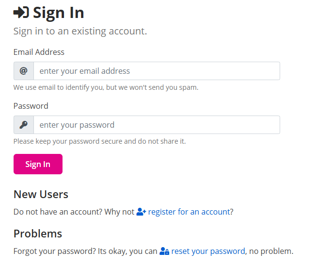

When you are login you will need to retrieve your API Token in your user settings.

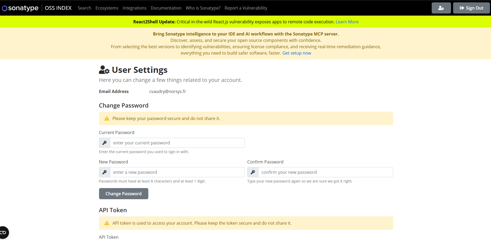

With the email use to login to Sonatype OSS Index and the API token, you will be able to configure the corresponding analyzer in DependencyTrack.

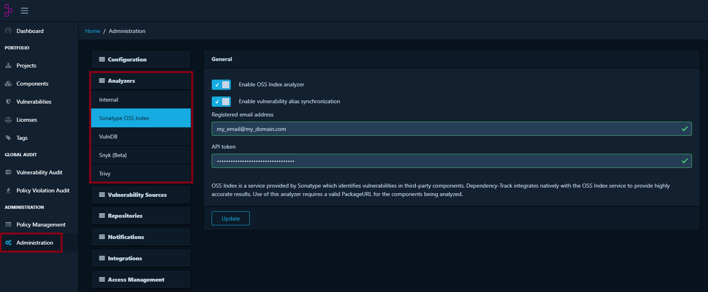

The second analyzer we will configure is Trivy, the instance launched with our docker compose file.
The server URL is http://trivy-server:9000 and the API token is the value defined for `TRIVY_SERVER_TOKEN` in the `.env` file.

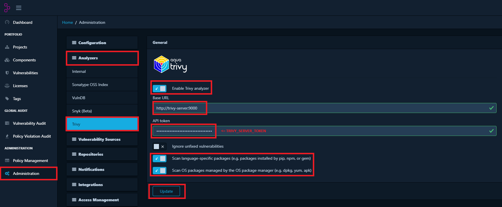

If you want to check if your Trivy Server is correctly listening on port `9000`, you can make a healthcheck request on http://localhost:9000/healthz. 
There is a small Bruno project with this request in the project.

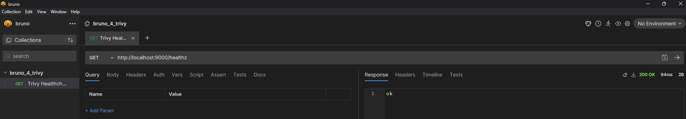

If you have a GitHub account, you can define a personal access token.
You have to go in the settings of your profile, in the "Developer settings" part.

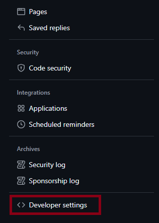

You should be able to generate a token to use with DependencyTrack.

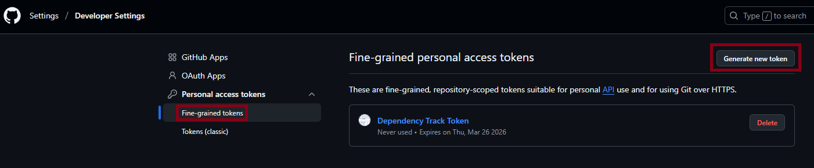

Your token doesn't need any special permissions or access.

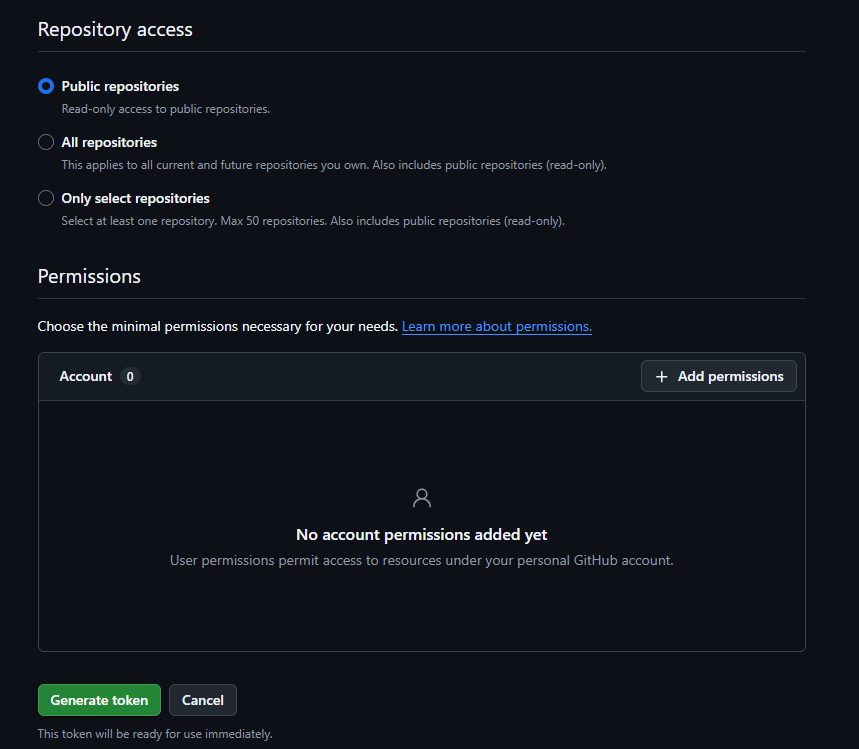

You can now use your personal access token in DependencyTrack to have GitHub Advisories has another vulnerability sources.

## Using Trivy Client to generate SBOM

You have Dependency Track up and running. We will now use it to check two dummy projects. 
There is a Spring project and a Next project, just the initialized project for this 2 frameworks. 

To analyze a project in Dependency Track, you will need an SBOM (Software Bill Of Materials), this is a list in a specific format of all the dependencies in your project. 
To obtain theses SBOM you can use several tools. 
Here we will use Trivy, as a client tool and not a server here, because it is quite agnostic of the language or framework use in the projetc from which we want to extract the SBOM and it ise easy to install and use.

So first, you should get Trivy. Personnaly I have installed the binary version : you download an archive, you decompress it wherever you want and add the directory to your path, and your done.

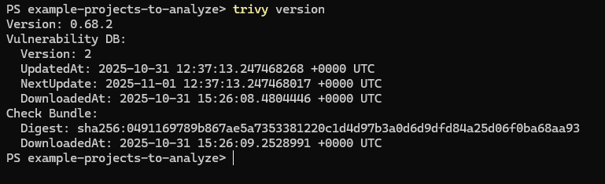

If I want to generate the SBOM for one of the Spring or the Next project, I will run in the shell `trivy fs --format cyclonedx --scanners vuln,license,misconfig --include-dev-deps --timeout 15m --output .\sbom-cyclonedx-trivy-next.json .\next-example-app`.

The command line is quite long but straighforward :

- we are doing the analysis against a directory with some code thus the `fs` (for file system) ; you can use trivy to scan a docker image or a kubernetes cluster.
- we want our SBOM in the [CycloneDX](https://medium.com/r/?url=https%3A%2F%2Fcyclonedx.org%2F) format thus the `--format cyclonedx` ; there are several competing formats for SBOM but CycloneDX is backed by OWASP and is now a standard.
- we want information about vulnerabilities, licenses, and misconfiguration in infrastructure as code files, thus the `--scanners vuln,license,misconfig` ; you can also scan for exposed secrets.
- we want to include development dependencies, thus the `--include-dev-deps` ; if you do not want them you do not add this option.
- we want to limit the duration of the scan to 15 minutes, thus the `--timeout 15m` ; this option is particularly interesting in a CI.
- we want our SBOM file in a file name `sbom-cyclonedx-trivy-next.json` in the directory in which the scan is launched, thus the `--output .\sbom-cyclonedx-trivy-next.json`.
- and we want to scan the code directory `next-example-app`.

To sum up, to generate a SBOM for our 2 projects without the development dependencies included :

```
trivy fs --format cyclonedx --scanners vuln,license,misconfig --timeout 15m --output .\sbom-cyclonedx-trivy-next.json .\next-example-app
trivy fs --format cyclonedx --scanners vuln,license,misconfig --timeout 15m --output .\sbom-cyclonedx-trivy-spring.json .\spring-example
```

And to generate a SBOM for our 2 projects with the development dependencies included:

```
trivy fs --format cyclonedx --scanners vuln,license,misconfig --include-dev-deps --timeout 15m --output .\sbom-cyclonedx-trivy-next.json .\next-example-app
trivy fs --format cyclonedx --scanners vuln,license,misconfig --include-dev-deps --timeout 15m --output .\sbom-cyclonedx-trivy-spring.json .\spring-example
```

If we scan our 2 dummy projects, we will obtain to SBOM that we can import in Dependency Track.

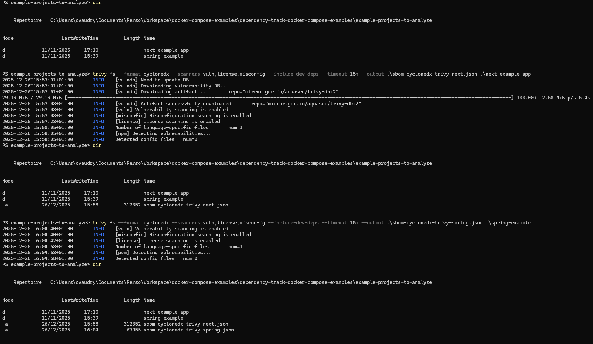

To keep things simple, in Dependency Track we will create two new projects , one for each of the project to analyze.

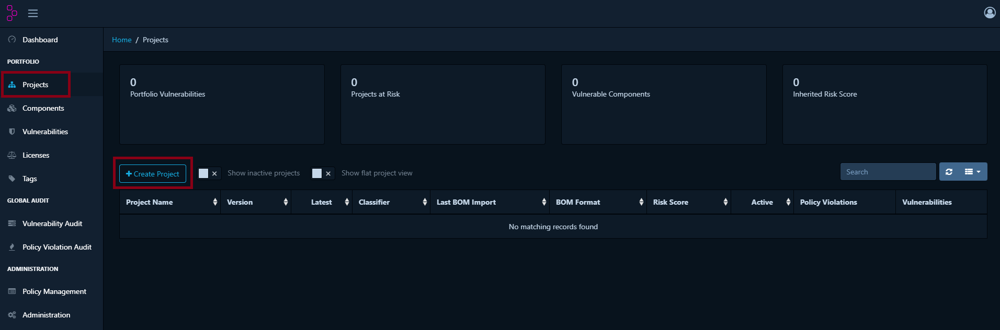

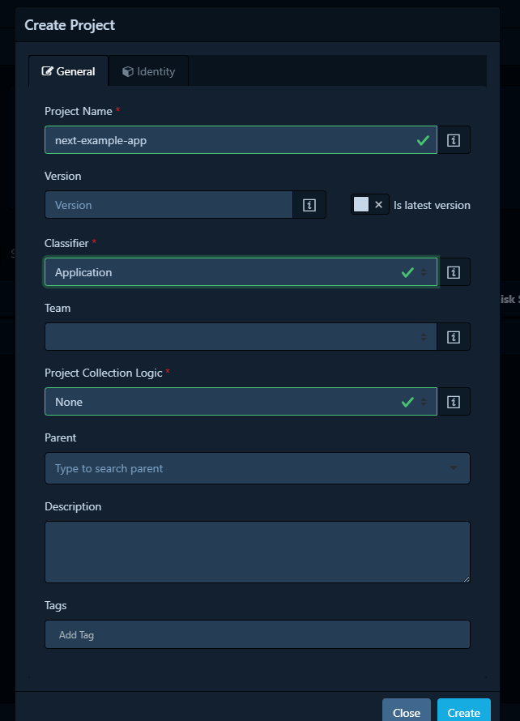

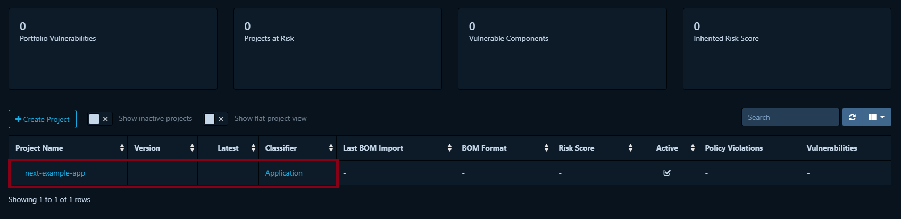

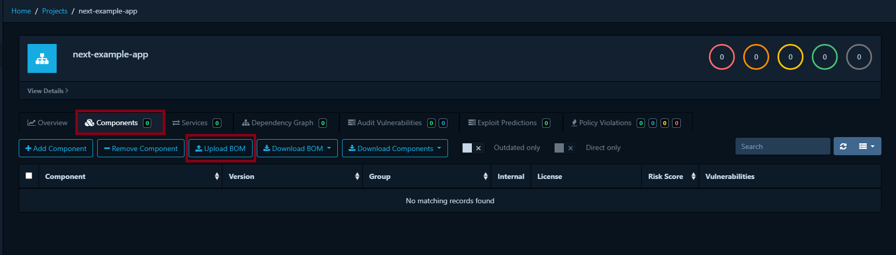

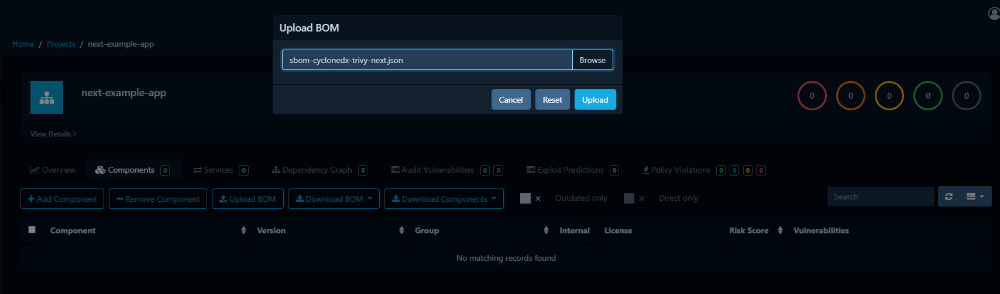

After a refresh of the page, after the import you should be able to see the vulnerabilities in the project from which you have imported the SBOM.

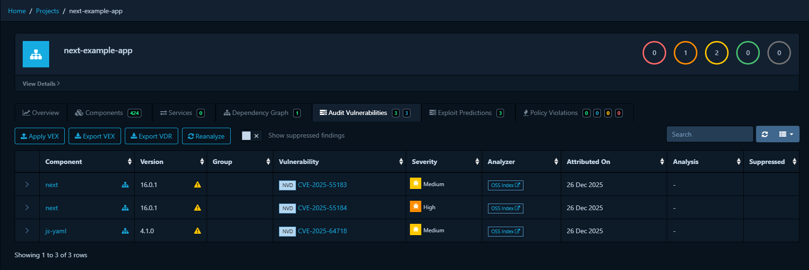

You can repeat the same actions for the second project.

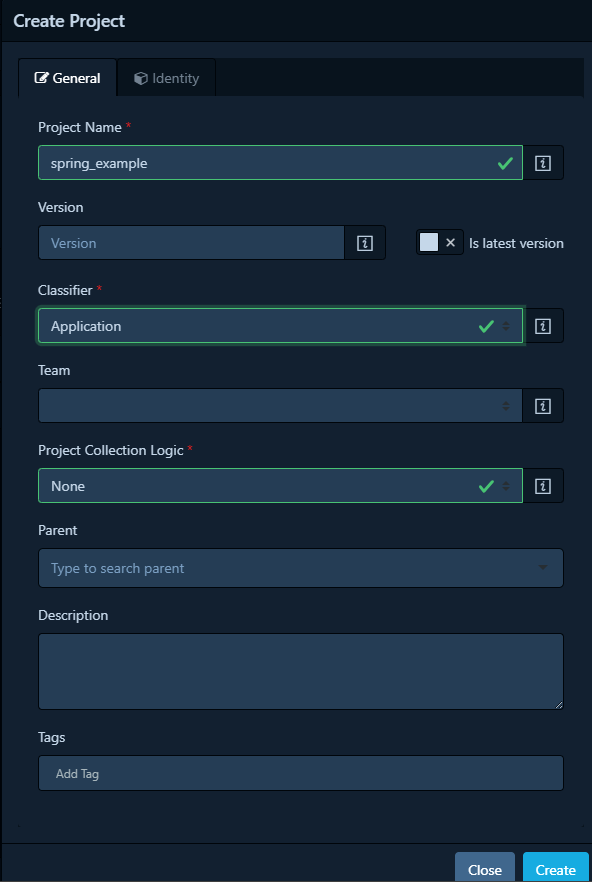

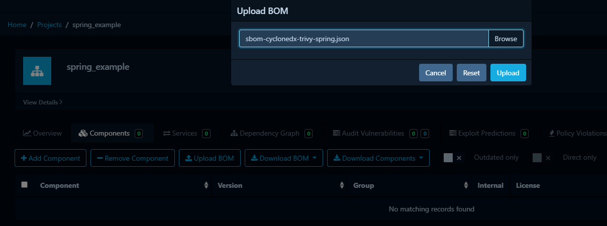

After a refresh, as soon as Dependency Track has been able to process the SBOM, you should have the analysis available for your 2 projects.

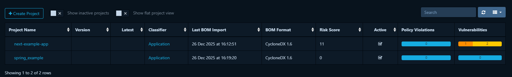

## Ressources

If you need a more information related to the PostgreSQL instance or want some other components related to it (for example pgadmin or metabase), there is a dedicated [blog post on Medium](https://medium.com/norsys-octogone/a-local-environment-for-postgresql-with-docker-compose-7ae68c998068) on creating a docker local environmment for PostgreSQL and a [sibling project on GitHub](https://github.com/TGITS/docker-compose-examples/tree/main/postgresql-docker-compose-examples).
