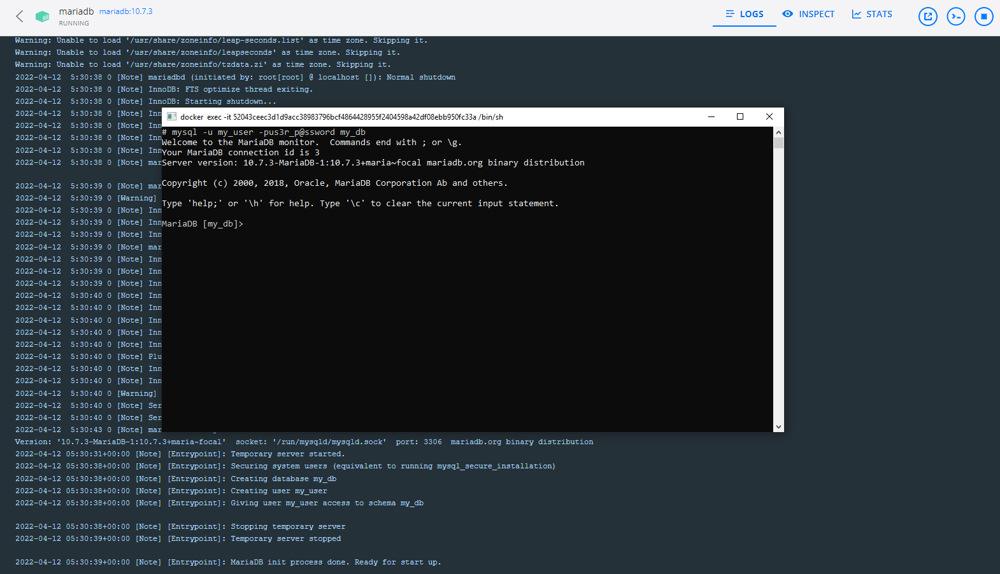

# MariaDB

## Mode mono-instance 

### Lancement du conteneur avec l'instance MariaDB

Pour lancer l'instance MariaDB avec _docker compose_ :

```
docker compose -f dc-mariadb-single.yml up -d
```

En ouvrant un shell sur le conteneur, on peut essayer de se connecter à MariaDB pour voir si tout est opérationnel : `mysql -u my_user -pus3r_p@ssword my_db`



### Arrêt du conteneur

Pour arrêter le conteneur et la base :

```
docker compose -f dc-mariadb-single.yml down
```

## Mode cluster

**TODO**

## Clients

### CLI

### DBeaver

**TODO**

## Ressources

La [_Knowledge Base_](https://mariadb.com/kb/en/) sur [le site officiel de MariaDB](https://mariadb.com/).