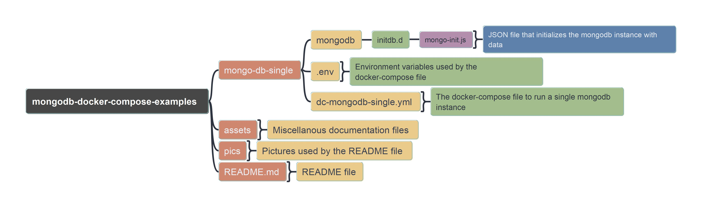

# MongoDB

This [small project](https://github.com/TGITS/docker-compose-examples) provides a _docker compose file_ and a minimalist directory structure that creates a local environment for the [MongoDB](https://www.mongodb.com/) database to be used for development and experimentation.
Do not use this directly in a production enviroment or at your own risk !
Two applications are provided by the _docker compose file_:

* A MongoDB single instance
* [mongo-express](https://github.com/mongo-express/mongo-express) which is a web-based MongoDB administration interface.

This project has been developed and tested under Windows 11 Professional with [Podman](https://podman.io/) and Podman Desktop.
However it should work on Windows, Mac and Linux, with [Docker](https://www.docker.com/), [Docker Desktop](https://www.docker.com/products/docker-desktop/) or [Rancher Desktop](https://rancherdesktop.io/).

In all cases you need to have a container engine compatible with `docker` and `docker compose` available in the command line.

On the container with the [MongoDB](https://www.mongodb.com/) database engine, there is also [MongoDB Shell](https://www.mongodb.com/try/download/shell). However, you can install it directly on your PC to access any MongoDB instances accessible on your network if you wish so.

You can also install and use [Compass](https://www.mongodb.com/products/tools/compass). Compass is a graphical client to connect to MongoDB instances.

## Running the containers with the MongoDB instance

To run the containers and the associated **MongoDB** instance with `docker compose`, open a shell, go to the `mongodb-docker-compose-examples/mongodb-single` directory and run the following command :

```txt
docker compose -f dc-mongodb-single.yml up -d
```


In Docker Desktop, Rancher Desktop or Podman Desktop you should be able to see the container running (in the following screenshot it is with Podman Desktop).


### Accessing MongoDB with the CLI in the container

To check that all is ok, you can open a shell on the container and connect to the MongoDB instance with the CLI by running `mongosh` as described thereafter :

* To be connected as administrator and be able to see available users and databases
  * `mongosh --port 27017  --authenticationDatabase "admin" -u "root" -p`
    * You will be asked the password (it is defined in the `.env` file in the variable `MONGO_INITDB_ROOT_PASSWORD`)
  * you can show the databases with `show dbs`


* To be connected as the user defined in the `mongo-init.js` file (`jon_snow`) :
  * `mongosh got_db -u "jon_snow" -p`
    * You has then to type the password specified for the user `jon_snow` in the `mongo-init.js` file (the password is `ygritte` by the way)
  * You can express a query against the database : `db.got_seasons_collection.find({}, { season : 1, year : 1 })`


If you want to stop the containers, you just have to execute in the command line the following command (considering you still are in the directory `mongodb-docker-compose-examples/mongodb-single`) :

```txt
docker compose -f dc-mongodb-single.yml down
```

### Accessing MongoDB with mongo-express

You have to access by pointing your browser to the url `http:\\localhost:8081`. You will be prompted to enter a login and a password : you type the value defined for `MONGO_EXPRESS_USERNAME` and `MONGO_EXPRESS_PASSWORD` in the `.env` file.


You then have access to the `mongo-express` Web UI connected to your local MongoDB instance.


## Installing MongoDB Shell on your computer and using it to connect to the MongoDB instance

You can download and install [Mongosh](https://www.mongodb.com/try/download/shell) directly on you PC.
It is available as a zip archive, you just have to unzip it wherever it suits you and add the bin directory with the `mongosh` executable in your path.
You then should be able to connect with `mongosh` to any instance of MongoDB if you provide the correct parameters.
If you just type `mongosh` in a terminal, by default it will try to connect to a MongoDB instance on `127.0.0.1` and port `27017`.
If your instance is up it will connect to it but you cannot do much because you will not be authenticated.

So if we want to authenticate as user `jon_snow` which has rights on the database `got_db`, first we will switch to this database and then authenticate within the shell :

```txt
use got_db
db.auth("jon_snow", "ygritte")
```


You are now connected as user `jon_snow` and can express query against the database (for example `db.got_seasons_collection.find({}, { season : 1, year : 1 })`).

## Installing Compass and using it to accessing MongoDB

If you prefer desktop graphical client you can install [Compass](https://www.mongodb.com/products/tools/compass).
It can be downloaded and install in various format for various operating system.
On Windows, it can be downloaded as a zip archive, an `.exe` and an `.msi`.
The installation is quite straightforward but depending on the installation package downloaded you may have to create the desktop shortcut yourself and add the binary to the path.
When all is correctly setup you should be able to run [Compass](https://www.mongodb.com/products/tools/compass).


You can now connect to the local instance.


You can now connect directly or save the connection to not have to type the information again before the connection occurs.


## Installing Visual Studio Code Plugin

If you use Visual Studio Code you can install [an official extension](https://www.mongodb.com/products/tools/vs-code) that allows you to access a MongoDB instance.


When you have installed the extension, you just need to connect to your instance.


")


The complete documentation of this plugin can be found on the [official site](https://www.mongodb.com/docs/mongodb-vscode/).

## Inner Workings

The  main directories and files of this project are quickly presented in the following pictures.



The following image gives a synthetic view of the docker compose file.


The `.env` file defined some system variables used in the docker compose file :

```yaml
MONGO_INITDB_ROOT_USERNAME=root
MONGO_INITDB_ROOT_PASSWORD=password
MONGO_EXPRESS_USERNAME=admin
MONGO_EXPRESS_PASSWORD=password
```

You can of course change the values to your liking if necessary.

The docker compose file is quite simple and straightforward.

```yaml
version: '3.9'

services:
  mongodb:
    image: mongo:latest
    container_name: mongodb
    hostname: mongodb
    volumes:
      - ./mongodb/initdb.d/mongo-init.js:/docker-entrypoint-initdb.d/mongo-init.js:ro
      - mongodb-data:/data/db/
      - mongodb-log:/var/log/mongodb/
    env_file:
      - .env
    environment:
      MONGO_INITDB_ROOT_USERNAME: ${MONGO_INITDB_ROOT_USERNAME}
      MONGO_INITDB_ROOT_PASSWORD: ${MONGO_INITDB_ROOT_PASSWORD}
    ports:
      - "27017:27017"
    networks:
      - mongodb_network

  mongo-express:
    image: mongo-express:latest
    container_name: mongo-express
    restart: always
    environment:
      ME_CONFIG_MONGODB_ADMINUSERNAME: ${MONGO_INITDB_ROOT_USERNAME}
      ME_CONFIG_MONGODB_ADMINPASSWORD: ${MONGO_INITDB_ROOT_PASSWORD}
      ME_CONFIG_MONGODB_PORT: 27017
      ME_CONFIG_MONGODB_SERVER: 'mongodb'
      ME_CONFIG_BASICAUTH_USERNAME: ${MONGO_EXPRESS_USERNAME}
      ME_CONFIG_BASICAUTH_PASSWORD: ${MONGO_EXPRESS_PASSWORD}
    ports:
      - 8081:8081
    networks:
      - mongodb_network
    depends_on:
      - mongodb

volumes:
  mongodb-data:
    driver: local
    name: mongo-data
  mongodb-log:
    driver: local
    name: mongo-log

networks:
  mongodb_network:
    driver: bridge
    name: mongo-network
```

Two services are defined, one for `mongodb` and one for `mongo-express`.
In each case, the image retrieved is the `latest`.
You can (and in some case you should) change to point to a specific version of `MongoDB` or `mongo-express`.
A network and two volumes are defined.
The file `mongo-init.js` is mapped to a specific file inside the container.
You can note the `:ro` which means the volume is only readonly.
This file creates a database, a user with read et write rights on it and a collection in it, populated with some data (the list of episodes of the TV Show **A Game of Thrown**).

Of course, you can customize this initialization file to you specific use case, or event get rid of it if need be (in this case do not forget to delete the line `- ./mongodb/initdb.d/mongo-init.js:/docker-entrypoint-initdb.d/mongo-init.js:ro`).

```json
db = db.getSiblingDB("got_db");

db.createUser({
    user: "jon_snow",
    pwd: "ygritte",
    roles: [
      {
        role: 'readWrite', 
        db: 'got_db'
      },
    ],
  });

db.createCollection("got_seasons_collection");

db.got_seasons_collection.insertMany([
  {
    season: "1",
    year: "2011",
    episodes: [
      {
        number_overall: "1",
        number_in_season: "1",
        title: "Winter Is Coming",
        directors: ["Tim Van Patten"],
        writers: ["David Benioff", "D. B. Weiss"],
        original_air_date: "April 17, 2011",
        number_us_viewers: "2.22",
      },
      ...
      {
        number_overall: "73",
        number_in_season: "6",
        title: "The Iron Throne",
        directors: ["David Benioff", "D. B. Weiss"],
        writers: ["David Benioff", "D. B. Weiss"],
        original_air_date: "May 19, 2019",
        number_us_viewers: "13.61",
      },
    ],
  },
]);      
```


If you really do not want to have an initial user, database and collection created with your MongoDB instance, you can use `mongodb-empty-single/dc-mongodb-empty-single.yml` instead of `mongodb-single/dc-mongodb-single.yml` : the working principles are identical, there is just no initialization of the instance with data.

```txt
docker compose -f dc-mongodb-empty-single.yml up -d
```

With all this you should have a base for a local development environment for MongoDB, that you can customize if you need to.
It's now up to you to explore MongoDB with it.

## Bibliography

* [Documentation](https://www.mongodb.com/docs/) on the [official MongoDB site](https://www.mongodb.com/)
  * [db.auth()](https://www.mongodb.com/docs/manual/reference/method/db.auth/)
  * [Docker and MongoDB](https://www.mongodb.com/compatibility/docker)
* [MongoDB Official Docker Image](https://hub.docker.com/_/mongo)
* [mongo-express official image](https://hub.docker.com/_/mongo-express)
* [How to Run MongoDB as a Docker Container?](https://www.geeksforgeeks.org/how-to-run-mongodb-as-a-docker-container/)
* [Quick MongoDB Docker Setup](https://cj-hewett.medium.com/quick-mongodb-docker-setup-d1959c8fc8f2)
* [Docker: Initialize custom users and databases in MongoDb](https://dev.to/mikelogaciuk/docker-initialize-custom-users-and-databases-in-mongodb-3dkb)
* [How to Run an Init Script for MongoDB in Docker Container](https://becomegeeks.com/blog/how-to-run-an-init-script-for-mongodb-in-docker-container/)
