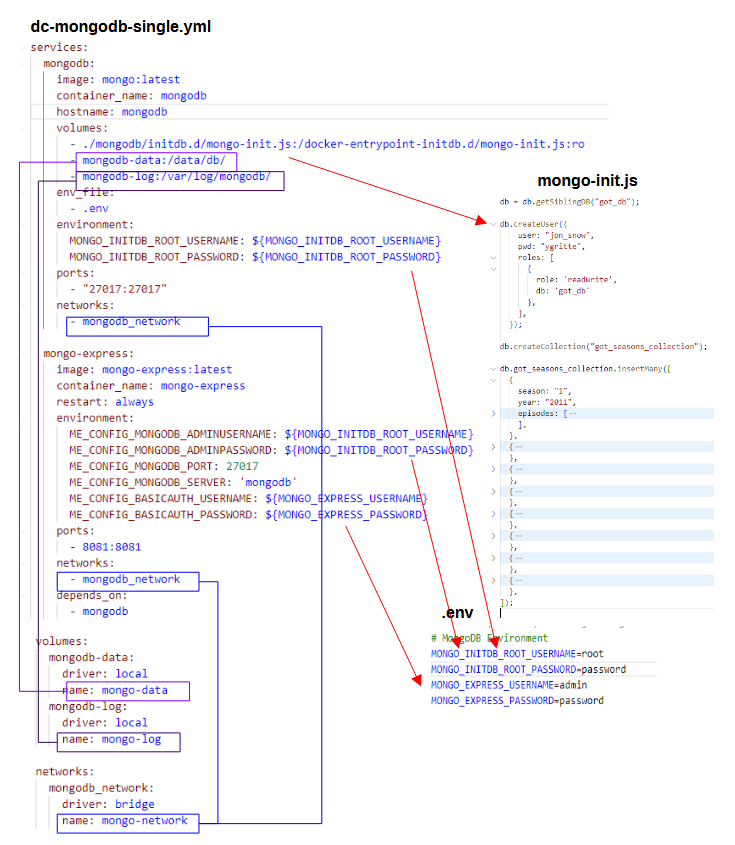

# MongoDB

This small project provides a docker compose file and a directory structure that create a local environment for mongodb that can be used for developement and experimentation purposes.
Do not use this directly in a production enviroment or at your own risk !
Two containers are provided :

* One which runs a MongoDB single instance
* One which runs [mongo-express](https://github.com/mongo-express/mongo-express) which is a web-based MongoDB administration interface.

This project has been developed and tested under Windows 11 Professional with Podman and Podman Desktop.
However it should work on Windows, Mac and Linux, with Docker, Docker Desktop or Rancher Desktop.

In all cases you need to have a container engine compatible with docker and `docker compose` available in the command line.

With MongoDB, on the container, [MongoDB Shell](https://www.mongodb.com/try/download/shell) is available. However, you can install it directly on your laptop to access any MongoDB instance accessible on your network if you wish so.

You can also install and use [Compass](https://www.mongodb.com/products/tools/compass). Compass is graphical client to connect to MongoDB instances.

## Running the containers with the MongoDB instance

To run the containers and the associated **MongoDB** instance with `docker compose`, open a shell, go to the `mongodb-docker-compose-examples/mongodb-single` directory and run the following command :

```txt
docker compose -f dc-mongodb-single.yml up -d
```

## Accessing MongoDB with the CLI in the container


In Docker Desktop, Rancher Desktop or Podman Desktop you should be able to see the container running (in the following screenshot it is with Podman Desktop).


To check that all is ok, you can open a shell on the container and connect to the MongoDB instance with the CLI by running `mongosh` as described thereafter :

* To be connected as administrator and be able to see available users and databases
  * `mongosh --port 27017  --authenticationDatabase "admin" -u "root" -p`
    * You will be asked the password (it is defined in the `.env` file in the variable `MONGO_INITDB_ROOT_PASSWORD`)
  * you can show the databases with `show dbs`


* To be connected as the user defined in the `mongo-init.js` file (`jon_snow`)
  * `mongosh got_db -u "jon_snow" -p`
    * You has then to type the password for the user `jon_snow` in the `mongo-init.js` file (the password is `ygritte` by the way)
  * You can express a query against the database : `db.got_seasons_collection.find({}, { season : 1, year : 1 })`


If you want to stop the containers, you just have to execute in the command line the following command (considering you are still in the directory `mongodb-docker-compose-examples/mongodb-single`) :

```txt
docker compose -f dc-mongodb-single.yml down
```

## Accessing MongoDB with mongo-express

## Installing MongoDB Shell on your computer and using it to connect to the MongoDB instance

You can download and install [Mongosh](https://www.mongodb.com/try/download/shell) directly on you PC.
It is available as a zip archive, you just have to unzip it wherever it suits you and add the bin directory with the `mongosh` executable in you path.
You then should be able to connect with mongosh to any instance of MongoDB if you provides the correct parameters.
If you just type `mongosh` in a terminal, by default it will try to connect to a MongoDB instance on `127.0.0.1` and port `27017`.
If your instance is up it will connect to it but you cannot do much because you will not be authenticated.


So if we want to authenticate as user `jon_snow` which has rights on the database `got_db`, first we will switch to this database and then authenticate within the shell :

```txt
use got_db
db.auth("jon_snow", "ygritte")
```

## Installing Compass and using it to accessing MongoDB

If you prefer desktop graphical client you can install [Compass](https://www.mongodb.com/products/tools/compass).
It can be downloaded and install in various format for various operating system.
On Windows, it can be downloaded as a zip archive, an `.exe` and an `.msi`.
The installation is quite straightforward but depending on the installation package downloaded you may have to create the desktop shortcut yourself and add the binary to the path.
When all is correctly setup you should be able to run [Compass](https://www.mongodb.com/products/tools/compass).


You can now connect to the local instance.


You can now connect directly or save the connection to not have to type the information again before the connection occurs.


## Some explanations

Some explanations about the docker-compose file, the directory structure and the initialisation data.

### Directory structure


### Docker compose file



### Initialisation

## Ressources

* [Documentation](https://www.mongodb.com/docs/) on the [official MongoDB site](https://www.mongodb.com/)
* [db.auth()](https://www.mongodb.com/docs/manual/reference/method/db.auth/)
