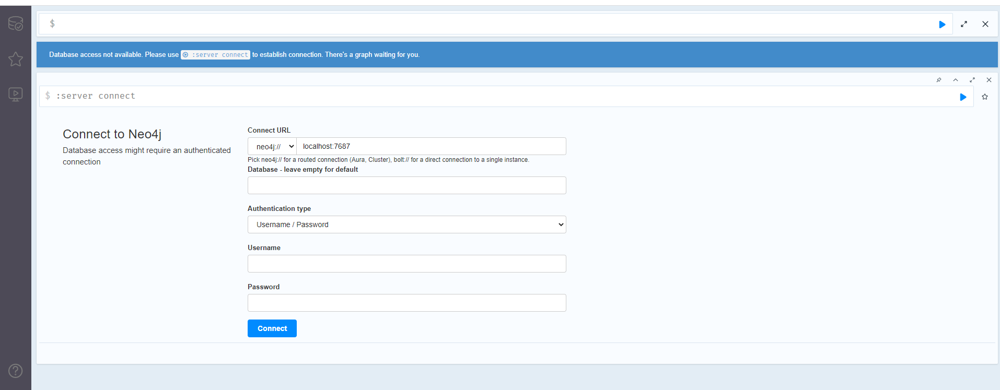
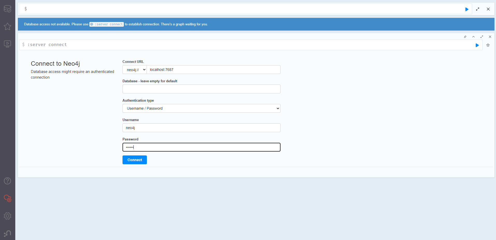
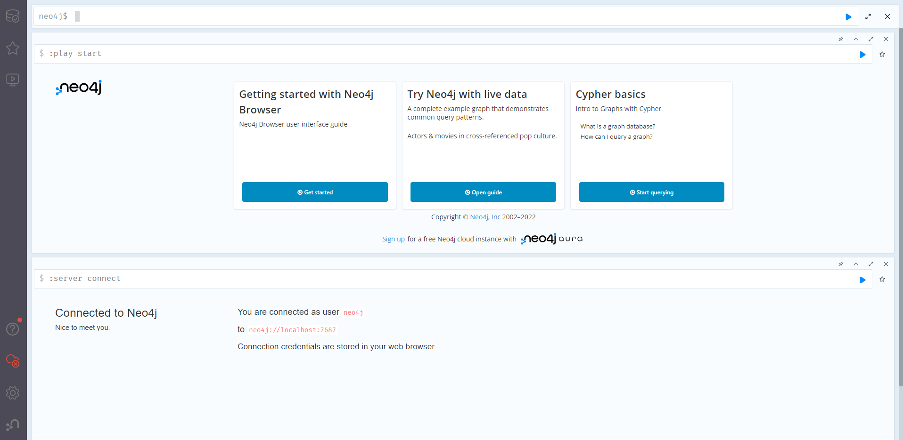
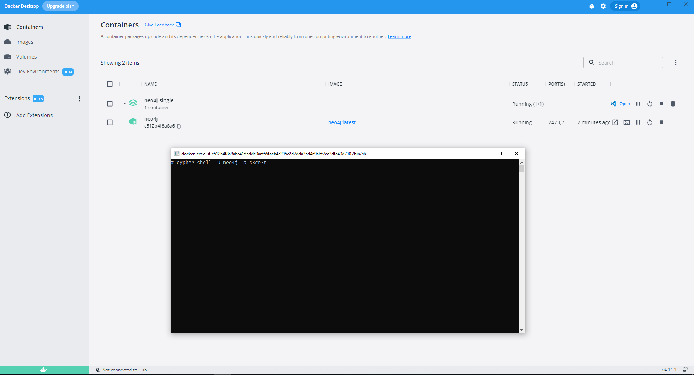

# Neo4j

## Mode mono-instance 

### Lancement du conteneur avec l'instance Neo4j

Pour lancer le conteneur avec l'instance Neo4j en utilisant _docker compose_ :

```
docker compose -f dc-neo4j-single.yml up -d
```

Pour se connecter sur l'instance avec le client Web aller avec un navigateur sur : `http://localhost:7474/browser/`. 







### Arrêt du conteneur

Pour arrêter le conteneur :

```
docker compose -f dc-neo4j-single.yml down
```

## Clients

### CLI

* Connexion en bash sur l'image : `docker exec -it neo4j bash`
* Lancement du shell de Neo4j : `cypher-shell -u neo4j -p s3cr3t`
  * Bien sûr on peut ouvrir directement un terminal sous Docker Desktop et lancer le shell de Neo4j
    * Avec lancement de la requête `MATCH (n) RETURN count(n);` (reprise de la [documentation officielle ici](https://neo4j.com/developer/docker-run-neo4j/))
      * Bien faire attention que la requête doit se terminer par un `;`.
    * La commande pour sortir est `:exit`




### Clients Web

* Pour se connecter sur l'instance avec le client Web aller avec un navigateur sur : `http://localhost:7474/browser/`. 
  * Il suffit de saisir les informations de connexion pour commencer.


## Ressources

* [How to install Neo4j with Docker-Compose?](https://thibaut-deveraux.medium.com/how-to-install-neo4j-with-docker-compose-36e3ba939af0)
* [Neo4j with Docker](https://neo4j.com/developer/docker/)
* [How-To: Run Neo4j in Docker](https://neo4j.com/developer/docker-run-neo4j/)
* [Neo4j Operations Manual - Docker](https://neo4j.com/docs/operations-manual/current/docker/)
* [Images Officielles sur DockerHub](https://hub.docker.com/_/neo4j/)
* [Documentations Officielles](https://neo4j.com/docs/)
* [GraphAcademy](https://graphacademy.neo4j.com/)