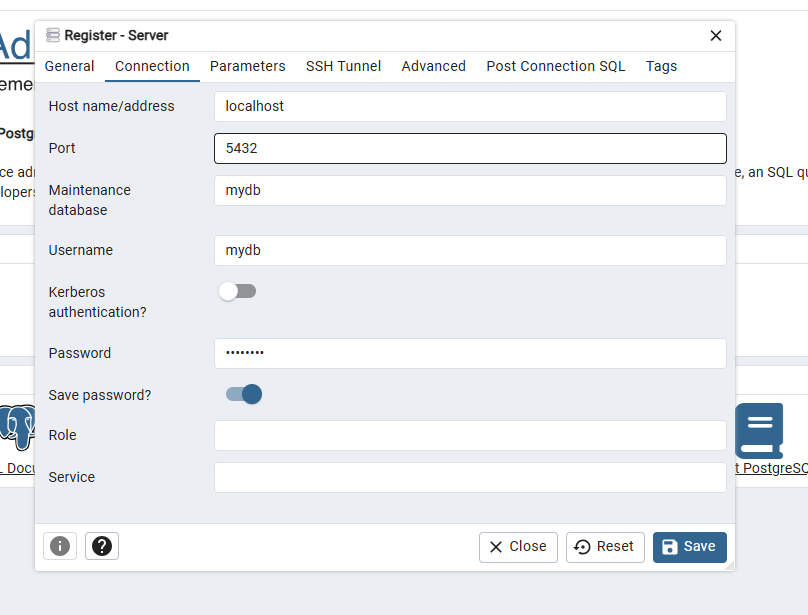

# Simple Docker Compose for a Single Instance Postgresql

## Running the container with the Postgresql instance

To run the container and the associated with the associated Postgresql instance using `docker compose`, open a shell on your computer go to the `postgresql-docker-compose-examples/postgresql-complete` directory and run the following

```txt
docker compose -f dc-postgresql-complete.yml up -d
```

If your are on Windows, you can use WSL or if you have the docker engine installed (via Docker Desktop or Rancher Desktop) you can use Windows Powershell.


## Accessing the PostgreSQL instance with the CLI in the container

To access your database instance with the dedicated CLI from a shell in the container itself : 

* open an interactive shell on the running container of our postgres instance : `docker exec -it postgres /bin/sh`
  * The container name defined in `dc-postgresql-complete.yml` is `postgres`
* Running the Postgres CLI : `psql -W -Umydb -dmydb`. 
  * With the option `-W`, you will be prompted for the password
  * The password is defined in the `.env` file, under the variable `POSTGRES_PASSWORD`
* To quit `psql` you can type `exit`
* To quit the shell you can also type `exit`

The `.env` file defines the 3 environment variables used in the docker compose file `dc-postgresql-complete.yml` : `POSTGRES_DB`, `POSTGRES_USER`, `POSTGRES_PASSWORD`, which respectively corresponds to the name of a Postgres Database, the name of a user of this database and the password of this user.
The Postgres instance will be created with this database and the associated user.


## Accessing the PostgreSQL instance with pgAdmin

When the containers are up, pgAdmin will be available on `localhost:5433`
To configure pgAdmin :

* When the application is started, on your first run, you should have something similar to the next screenshot. You have to provide the values of the environment variables `PGADMIN_DEFAULT_EMAIL` and `PGADMIN_DEFAULT_PASSWORD`


* You first need to register a new server by a right click on `Servers` in the `Object explorer`


* A popup window with several tabs should appear.
* In the `General` tab you have to fill the `Name` field (this is the name you want to give to your PostgreSQL Instance, it can be whatever you want). You should also toggle on the `Connect now ?` button.


* In the `Connection` tab, you have to fill the `Host name/address` field with the value `postgres` (the host name of the PostgreSQL instance in the container), the `Port` field with the value `5432`, and the fields `Maintenance database`, `Username` and `Password` with respectively the values of the environment variables `POSTGRES_DB`, `POSTGRES_USER`, `POSTGRES_PASSWORD`.


* When you click on the `Save` button, pgAdmin should connect to the database server and it should appear in the `Object Explorer` panel.


* You can navigate to the table `Pokemon` which should have been initialized


## Accessing the PostgreSQL instance with Metabase

Metabase is not a database tool like pgAdmin or DBeaver. It is a _business intelligence_/_analytics_ platform : you will not directly do low level SQL requests or working directly on the Database. It's a tool to manipulate you data to extract information from them. 
As such it does not have the same use as pgAdmin but can be useful in its own right depending on your needs.

When the containers are up, metabase will be available on `localhost:5434`


## Accessing the PostgreSQL instance with DBeaver

[DBeaver Community](https://dbeaver.io/) is an open source and free tool that offers a graphical user interface to access various relational databases including Postgresql.

After starting DBeaver :

* Go in the menu `File` and select the `New` option (`File > New`) or use the shortcut `Ctrl+N`
* Select `DBeaver > Database Connection` and click on the `Next` button


* Select `PostgreSQL` and click on the `Next` button


* A window with the connection settings to fill should open.
  * You should change the value for `Database` (should be the value associated with `POSTGRES_DB` in the `.env` file), for `Username` (should be the value associated with `POSTGRES_USER` in the `.env` file) and `Password` (should be the value associated with `POSTGRES_PASSWORD` in the `.env` file).
  * The default value for the other fields should be the values you need.


* If it is the first time you try to connect to a PostgreSQL Database, you will need to download the database driver.
  * To this end, you have to select the tab `Driver properties`
  * DBeaver should propose to download a PostgreSQL driver, you just have to click on the `Download` button.
  * When the driver has been downloaded, you will now see the driver properties and you just have to click on the `Finish` button.


* You should now see the connection to your PostgreSQL Database in the `Database Navigator` view. 


* You can now access your new (empty) database.
  * You can found the created user under `Roles`


## Accessing the PostgreSQL instance with the pgAdmin Desktop client

When you [download pgAdmin 4](https://www.pgadmin.org/download/), it comes with a desktop GUI written in Electron.
Once pgAdmin is installed on your computer, it is under the subdirectory `runtime` with the name `pgAdmin4` or `pgAdmin4.exe` on Windows.
Executing this file will start the pgAdmin web application and the Electron application.
The whole application require a lot of ressources of your system and DBeaver is probably a more lightweigth solution.
However, pgAdmin is a very complete and powerful solution to work with a PostgreSQL instance.
As such it is a matter of needs and preferences.

To configure pgAdmin :

* Run the desktop application (`pgAdmin4` or `pgAdmin4.exe` on Windows)
* When the application is started, on your first run, you should have something similar to the next screenshot


* You first need to register a new server by a right click on `Servers` in the `Object explorer`


* A popup window with several tabs should appear.
* In the `General` tab you have to fill the `Name` field (this is the name you want to give to your PostgreSQL Instance, it can be whatever you want). You should also toggle on the `Connect now ?` button.


* In the `Connection` tab, you have to fill the `Host name/address` field with the value `localhost`, the `Port` field with the value `5432`, and the fields `Maintenance database`, `Username` and `Password` with respectively the values of the environment variables `POSTGRES_DB`, `POSTGRES_USER`, `POSTGRES_PASSWORD`.



* When you click on the `Save` button, pgAdmin should connect to the database server and it should appear in the `Object Explorer` panel.


## Stopping the container

To stop the container, type the following in your shell, from the directory which contains the docker compose file `dc-postgresql-complete.yml` :

```txt
docker compose -f dc-postgresql-complete.yml down
```


## Dedicated docker compose file

### Only a PostgreSQL instance

If you only need a postgreSQL instance you can use the docker compose file under `postgresql-docker-compose-examples/postgresql-only`.
To fire up the container :

```txt
docker compose -f dc-postgresql-complete.yml up -d
```
To stop it :

```txt
docker compose -f dc-postgresql-complete.yml down
```

The configuration of the different tools is similar to what have been presented previously.
In this example the PostgreSQL instance is not initialized with a table.

### PostgreSQL and pgAdmin

If you only need a postgreSQL instance with pgAdmin you can use the docker compose file under `postgresql-docker-compose-examples/postgresql-pgadmin`.
To fire up the container :

```txt
docker compose -f dc-postgresql-pgadmin.yml up -d
```
To stop it :

```txt
docker compose -f dc-postgresql-pgadmin.yml down
```

### PostgreSQL and Metabase

If you only need a postgreSQL instance with Metabase you can use the docker compose file under `postgresql-docker-compose-examples/postgresql-metabase`.
To fire up the container :

```txt
docker compose -f dc-postgresql-metabasen.yml up -d
```
To stop it :

```txt
docker compose -f dc-postgresql-metabase.yml down
```

## Ressources

* [Official PostgreSQL Site](https://www.postgresql.org/)
  * [Official Documentation](https://www.postgresql.org/docs/)
* [Postgresql Logo](https://wiki.postgresql.org/wiki/Logo)
* [PostgreSQL Official Image on Docker Hub](https://hub.docker.com/_/postgres)
* [pgadmin4 Official Image on Docker Hub](https://hub.docker.com/r/dpage/pgadmin4/)
* [Metabase](https://www.metabase.com/)
  * [Running Metabase on Docker](https://www.metabase.com/docs/latest/installation-and-operation/running-metabase-on-docker)
* [Metabase Official Image on Docker Hub](https://hub.docker.com/r/metabase/metabase)
* [PostgreSQL Clients](https://wiki.postgresql.org/wiki/PostgreSQL_Clients)
  * [pgAdmin](https://www.pgadmin.org/)
    * [Documentation](https://www.pgadmin.org/docs/pgadmin4/latest/index.html)
  * [DBeaver Community](https://dbeaver.io/)
  * [pgmanage](https://github.com/commandprompt/pgmanage)
* Documentation in French
  * [PostgreSQL documentation in French](https://docs.postgresql.fr/)
  * [Site of the French PostgreSQL community ](https://www.postgresql.fr/)
* [Pre-seeding database with schema and data at startup for development environment](https://docs.docker.com/guides/pre-seeding/)
* Baeldung tutorial if you just want to use Docker and not Docker Compose : [PostgreSQL with Docker Setup](https://www.baeldung.com/ops/postgresql-docker-setup)
* Medium Post which explains how to initialize a PostgreSQL Database : [Initializing a PostgreSQL Database with a Dataset using Docker Compose: A Step-by-step Guide](https://medium.com/@asuarezaceves/initializing-a-postgresql-database-with-a-dataset-using-docker-compose-a-step-by-step-guide-3feebd5b1545)
* The CSV File with the Pokemon data is from here : https://gist.github.com/armgilles/194bcff35001e7eb53a2a8b441e8b2c6