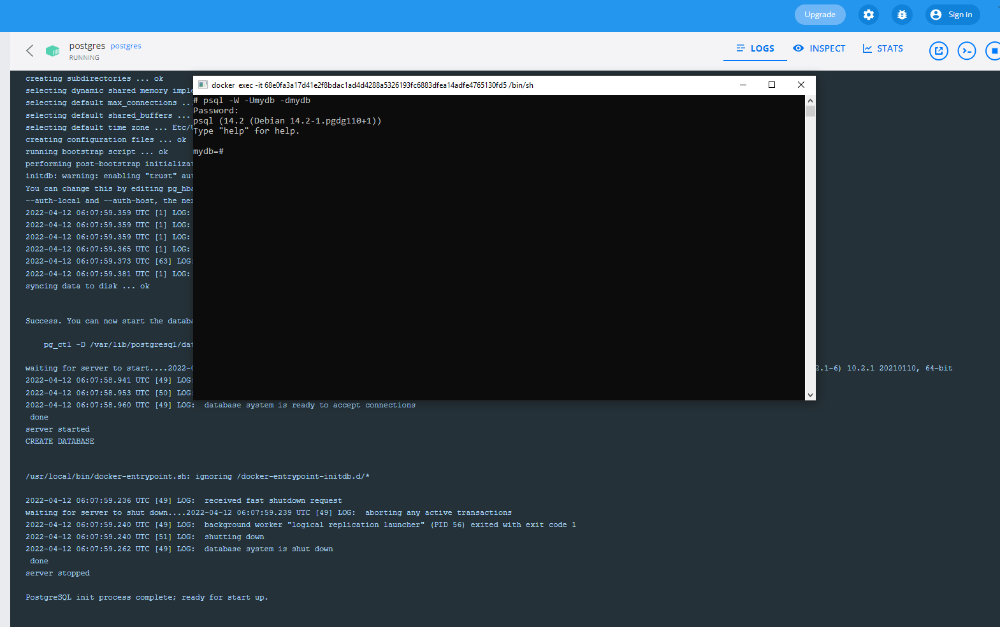

# Postgresql

## Mode mono-instance 

### Lancement du conteneur avec l'instance Postgresql

Pour lancer le conteneur avec l'instance Postgresql en utilisant _docker compose_ :

```
docker compose -f dc-postgresql-single.yml up -d
```

Pour se connecter sur l'instance avec la CLI depuis un shell sur le conteneur : `psql -W -Umydb -dmydb`. Aver l'option `-W` vous aurez un prompt pour saisir le mot de passe.



### Arrêt du conteneur

Pour arrêter le conteneur :

```
docker compose -f dc-postgresql-single.yml down
```

## Mode Cluster

**TODO**

## Clients

### CLI

**TODO**

### Clients lourds

#### DBeaver

**TODO**

## Ressources

[Documentation](https://docs.postgresql.fr/) sur le [site de la communauté francophone de PostgreSQL](https://www.postgresql.fr/).
[Site officiel de Postgresql](https://www.postgresql.org/).