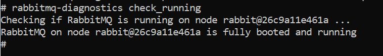
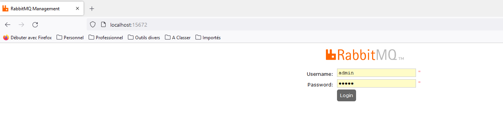
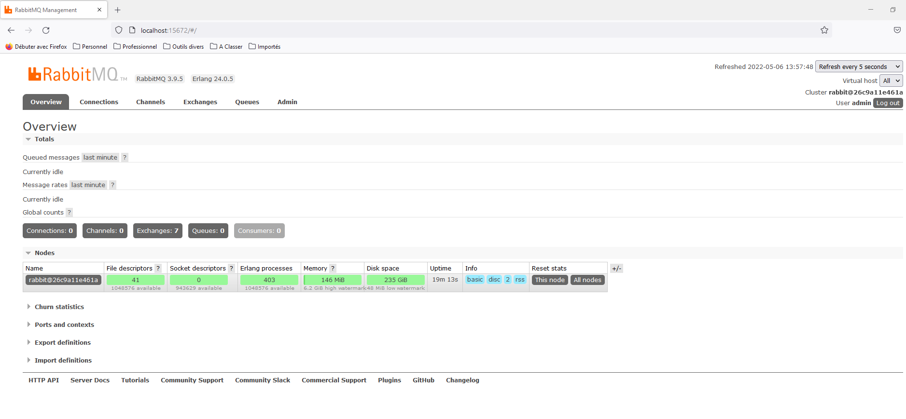

# RabbitMQ

## Mode mono-instance 

### Lancement du conteneur avec l'instance RabbitMQ

Pour lancer le conteneur et l'instance RabbitMQ avec docker-compose : 

```
docker-compose -f dc-rabbitmq-single.yml up -d
```

### Arrêt du conteneur

```
docker-compose -f dc-rabbitmq-single.yml down
```

## Mode cluster

**TODO**

## Clients

### CLI

Il y a plusieurs [outils en ligne de commande](https://www.rabbitmq.com/cli.html) disponibles avec RabbitMQ :

* [rabbitmqctl](https://www.rabbitmq.com/rabbitmqctl.8.html) pour gérer les noeuds de votre cluster.
* [rabbitmq-diagnostics](https://www.rabbitmq.com/rabbitmq-diagnostics.8.html) pour monitorer RabbitMQ
* [rabbitmq-plugins](https://www.rabbitmq.com/rabbitmq-plugins.8.html) pour gérer les plugins de RabbitMQ
* [rabbitmq-queues](https://www.rabbitmq.com/rabbitmq-queues.8.html) pour gérer les files de RabbitMQ
* [rabbitmq-upgrade](https://www.rabbitmq.com/rabbitmq-upgrade.8.html) pour gérer les installations de mise à jour.

Dans tous les cas, il vous faudra ouvrir un shell sur le conteneur de RabbitMQ :

```
docker exec -it rabbitmq sh
```

Une fois le shell ouvert, vous pouvez lancer l'un des outils CLI mentionnés ci-dessus.

#### rabbitmqadmin

Pour lancer l'aide de [rabbitmqadmin](https://www.rabbitmq.com/management-cli.html) depuis le shell

```
rabbitmqadmin --help
```

#### rabbitmq-diagnostics

```
rabbitmq-diagnostics check_running
```



**TODO**

#### rabbitmq-queues

**TODO**

#### rabbitmqctl

**TODO**

#### rabbitmq-plugins

**TODO**

#### rabbitmq-queues

**TODO**

#### rabbitmq-upgrade

**TODO**

### Client Web

Une fois le conteneur lancé vous pouvez accéder à l'interface d'administration Web sur `localhost` sur le port `15672`, à moins bien sûr que vous ayiez choisi un autre numéro de port dans votre dockerfile.

En allant sur `http://localhost:15672/`, vous arrivez sur une page de login



Les valeurs à renseigner pour le `Username` et le `Password` sont les valeurs que vous avez renseignez pour les variables d'environnement `RABBITMQ_DEFAULT_USER` et `RABBITMQ_DEFAULT_PASS`.



## Ressources

**TODO**
