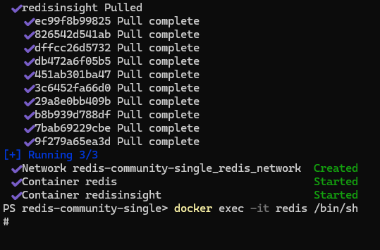

# Redis

This [small project](https://github.com/TGITS/docker-compose-examples/tree/main/redis-docker-compose-examples) provides a _docker compose file_ and a minimalist directory structure that creates a local environment for the [Redis](https://redis.io/) database to be used for development and experimentation.
Do not use this directly in a production enviroment or at your own risk !
Two applications are provided by the _docker compose file_:

* A Redis single instance
* [Redis Insight](https://redis.io/insight/) which is the official Redis Database tool

This project has been developed and tested under Windows 11 Professional with [Docker](https://www.docker.com/) and [Rancher Desktop](https://rancherdesktop.io/). However it should work on Windows, MacOs and Linux, with directly [Docker](https://www.docker.com/) or [Docker Desktop](https://www.docker.com/products/docker-desktop/).

In all cases you need to have a container engine compatible with `docker` and `docker compose` available in the command line.

On the container with [Redis](https://redis.io/) database engine, there is also [Redis CLI](https://redis.io/docs/latest/develop/tools/cli/). 

## Running the containers with the Redis instance

To run the containers and the associated **Redis** instance with `docker compose`, open a shell, go to the `redis-docker-compose-examples/redis-community-single` directory and run the following command :

```shell
docker compose -f dc-redis-single.yml up -d
```

If your are on Windows, you can use WSL or if you have the docker engine installed (via Docker Desktop or Rancher Desktop) you can use Windows Powershell.


## Accessing Redis with the CLI in the container

In a Powershell shell, run the following command line : `docker exec -it redis /bin/sh`.
You are now in a shell in the container.



Then type `redis-cli`.


You can now type Redis command. For example `keys *` which output the list of keys with any name in the base. In this empty database, there should be none.
You can type `quit` to exit `redis-cli` and of course `exit` to exit the shell if need be.

## Stopping the container

To stop the container, type the following in your shell, from the directory which contains the docker compose file dc-redis-single.yml :

```shell
docker compose -f dc-redis-single.yml down
```

## Accessing Redis from the Redis Insight Web Interface

[Redis Insight](https://redis.io/insight/) is available as a Web Application and as a Desktop client. 
In this paragraph we will use the Web Application deployed as a container along side Redis itself.
You have to connect to the url `http:\\localhost:5540` with your favorite navigator.

On your first connexion

### Another Redis Desktop Manager

* [Site Officiel](https://goanother.com/)
* [GitHub](https://github.com/qishibo/AnotherRedisDesktopManager)
  * [Téléchargement des binaires sur GitHub](https://github.com/qishibo/AnotherRedisDesktopManager/releases)

### Plugin Redis for Visual Studio Code

## WSL

### Pour le mode single

Lors d'un lancement depuis WSL, pour pouvoir accéder aux ports de Redis depuis windows il faut lancer le script suivant :

```powershell
$wslIp=(wsl -d Ubuntu -e sh -c "ip addr show eth0 | grep 'inet\b' | awk '{print `$2}' | cut -d/ -f1") # Get the private IP of the WSL2 instance

netsh interface portproxy delete v4tov4 listenport="6379" # Delete any existing port 6379 forwarding
netsh interface portproxy add v4tov4 listenport="6379" connectaddress="$wslIp" connectport="6379"
```


```

## Ressources

* Site officielle de Redis
  * [Redis configuration file example](https://redis.io/docs/latest/operate/oss_and_stack/management/config-file/)
    * [Configuration file for Redis 7.4.3](https://raw.githubusercontent.com/redis/redis/unstable/redis.conf)
* [Redis Insight configuration settings](https://redis.io/docs/latest/operate/Redis Insight/configuration/)
* [Creating Redis Cluster using Docker](https://medium.com/commencis/creating-redis-cluster-using-docker-67f65545796d)
* [Scaling with Redis Cluster](https://redis.io/docs/manual/scaling/)
* [Redis cluster specification](https://redis.io/docs/reference/cluster-spec/)
* [docker-redis-cluster](https://github.com/Grokzen/docker-redis-cluster)
* [How to Setup & Configure a Redis Cluster Easily](https://www.dltlabs.com/blog/how-to-setup-configure-a-redis-cluster-easily-573120)
* [Image Docker Officielle de Redis](https://hub.docker.com/_/redis)
* [How to Use the Redis Docker Official Image](https://www.docker.com/blog/how-to-use-the-redis-docker-official-image/)
* [Image Docker Officielle de Redis Insight](https://hub.docker.com/r/redis/Redis Insight)
* [Another Redis Desktop Manager](https://goanother.com/)
  * [GitHub](https://github.com/qishibo/AnotherRedisDesktopManager)
  * [Releases](https://github.com/qishibo/AnotherRedisDesktopManager/releases)
* Docker Networking
  * [Networking overview](https://docs.docker.com/engine/network/)
  * [Network drivers](https://docs.docker.com/engine/network/drivers/)
  * [Les réseaux dans docker-compose.yml](https://www.nicelydev.com/docker/reseau-docker-compose)
  * [Networking With Docker Compose (Quick Guide)](https://www.netmaker.io/resources/docker-compose-network)
  * [Networking in Compose](https://docs.docker.com/compose/how-tos/networking/)
  * [Services top-level elements](https://docs.docker.com/reference/compose-file/services/)
