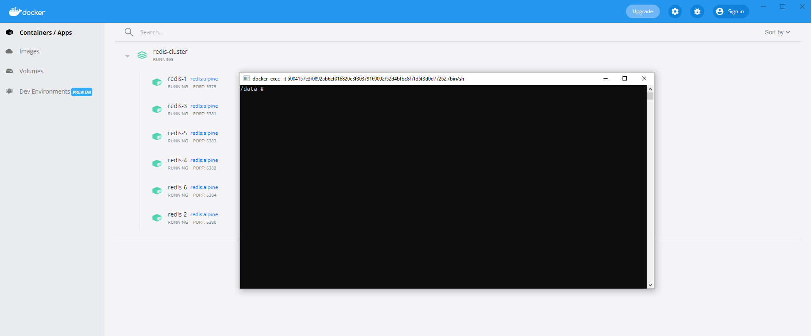
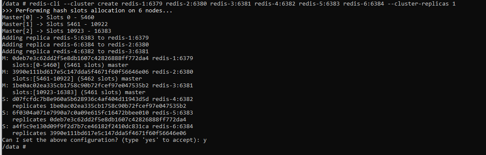

# Redis

## Mode mono-instance

### Lancement du conteneur avec l'instance Redis

```shell
docker compose -f dc-redis-single.yml up -d
```

### Arrêt du conteneur

```shell
docker compose -f dc-redis-single.yml down
```

## Mode cluster

### Lancement du conteneur avec les instances pour le cluster Redis

```shell
docker compose -f dc-redis-cluster.yml up -d
```

### Création du cluster

Ouverture d'un _shell_ sur l'une des instances crées dans l'invite de commande via `docker exec -it redis-1 sh` ou en ouvrant un shell sur sur **Docker Desktop**, par exemple sur l'instance `redis-1`.



Puis création du cluster avec le client Redis en ligne de commande : `redis-cli --cluster create redis-1:6379 redis-2:6380 redis-3:6381 redis-4:6382 redis-5:6383 redis-6:6384 --cluster-replicas 1`



### Arrêt du cluster

```shell
docker compose -f dc-redis-cluster.yml down
```

## Clients lourds

### RedisInsight

* [Site Officiel](https://redis.com/fr/redis-enterprise/redisinsight)

### Another Redis Desktop Manager

* [Site Officiel](https://goanother.com/)
* [GitHub](https://github.com/qishibo/AnotherRedisDesktopManager)
  * [Téléchargement des binaires sur GitHub](https://github.com/qishibo/AnotherRedisDesktopManager/releases)

## WSL

### Pour le mode single

Lors d'un lancement depuis WSL, pour pouvoir accéder aux ports de RabbitMQ depuis windows il faut lancer le script suivant :

```powershell
$wslIp=(wsl -d Ubuntu -e sh -c "ip addr show eth0 | grep 'inet\b' | awk '{print `$2}' | cut -d/ -f1") # Get the private IP of the WSL2 instance

netsh interface portproxy delete v4tov4 listenport="6379" # Delete any existing port 6379 forwarding
netsh interface portproxy add v4tov4 listenport="6379" connectaddress="$wslIp" connectport="6379"
```

### Pour le mode cluster

```powershell
$wslIp=(wsl -d Ubuntu -e sh -c "ip addr show eth0 | grep 'inet\b' | awk '{print `$2}' | cut -d/ -f1") # Get the private IP of the WSL2 instance

netsh interface portproxy delete v4tov4 listenport="6379" # Delete any existing port 6379 forwarding
netsh interface portproxy add v4tov4 listenport="6379" connectaddress="$wslIp" connectport="6379"

netsh interface portproxy delete v4tov4 listenport="6380" # Delete any existing port 6380 forwarding
netsh interface portproxy add v4tov4 listenport="6380" connectaddress="$wslIp" connectport="6380"

netsh interface portproxy delete v4tov4 listenport="6381" # Delete any existing port 6381 forwarding
netsh interface portproxy add v4tov4 listenport="6381" connectaddress="$wslIp" connectport="6381"

netsh interface portproxy delete v4tov4 listenport="6382" # Delete any existing port 6382 forwarding
netsh interface portproxy add v4tov4 listenport="6382" connectaddress="$wslIp" connectport="6382"

netsh interface portproxy delete v4tov4 listenport="6383" # Delete any existing port 6383 forwarding
netsh interface portproxy add v4tov4 listenport="6383" connectaddress="$wslIp" connectport="6383"

netsh interface portproxy delete v4tov4 listenport="6384" # Delete any existing port 6384 forwarding
netsh interface portproxy add v4tov4 listenport="6384" connectaddress="$wslIp" connectport="6384"
```

## Ressources

* [Creating Redis Cluster using Docker](https://medium.com/commencis/creating-redis-cluster-using-docker-67f65545796d)
* [Scaling with Redis Cluster](https://redis.io/docs/manual/scaling/)
* [Redis cluster specification](https://redis.io/docs/reference/cluster-spec/)
* [docker-redis-cluster](https://github.com/Grokzen/docker-redis-cluster)
* [How to Setup & Configure a Redis Cluster Easily](https://www.dltlabs.com/blog/how-to-setup-configure-a-redis-cluster-easily-573120)

docker compose -f dc-redis-single.yml up -d