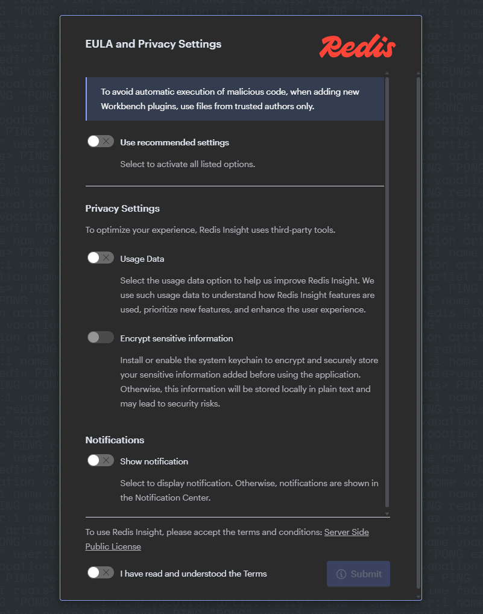

# Redis

This [small project](https://github.com/TGITS/docker-compose-examples/tree/main/redis-docker-compose-examples) provides _docker compose files_ and a minimalist directory structure that creates a local environment for the [Redis](https://redis.io/) database to be used for development and experimentation.
Do not use this directly in a production enviroment or at your own risk !

Several _docker compose files_ are provided respectively for Redis Community, Redis Stack Server and Redis Stack.
To simplify, Redis Stack Server is a Redis Community bundles with additional features (probalistic data structures, queryable JSON documents, time series data) and Redis Stack is a Red Stack Server bundled with Redis Insight.
However, at the time of writing, the Redis Stack Server and Redis Stack were only avaialble for Redis 7.4.4 (the latest version of Redis 7.4).
You have an understable little wait to use the very latest version of **Redis** with **Redis Stack Server** and **Redis Stack**.

For the Redis Community two applications are provided by the _docker compose file_:

* A Redis single instance
* [Redis Insight](https://redis.io/insight/) which is the official Redis database tool

For the Redis Stack Server only the Redis single instance is provided.
And for the Redis Stack the Redis single instance and a Redis Insight instance are provided.

This project has been developed and tested under Windows 11 Professional with [Docker](https://www.docker.com/) and [Rancher Desktop](https://rancherdesktop.io/). However it should work on Windows, MacOs and Linux, with directly [Docker](https://www.docker.com/) or [Docker Desktop](https://www.docker.com/products/docker-desktop/).

In all cases you need to have a container engine compatible with `docker` and `docker compose` available in the command line.

On the container with the [Redis](https://redis.io/) database engine, there is also [Redis CLI](https://redis.io/docs/latest/develop/tools/cli/).

The Redis Community versions targeted in the rest of this document is Redis 8 or above.
As a matter of fact, the way to configure Redis from the previous version is different starting Redis version 8.
If you need to run a Redis version prior to version 8, this is covered at the end of the document.

## Running the containers with the Redis instance

### Redis Community

To run the containers and the associated **Redis** instance with `docker compose`, open a shell, go to the `redis-docker-compose-examples/redis-community-single` directory and run the following command :

```shell
docker compose -f dc-redis-single.yml up -d
```

If you are on Windows, you can use WSL or if you have the docker engine installed (via Docker Desktop or Rancher Desktop) you can use Windows Powershell.


### Redis Stack Server

To run the container associated with the **Redis** instance with `docker compose`, open a shell, go to the `redis-docker-compose-examples/redis-stack-server` directory and run the following command :

```shell
docker compose -f dc-redis-stack-server.yml up -d
```

### Redis Stack

To run the containers and the associated **Redis** instance with `docker compose`, open a shell, go to the `redis-docker-compose-examples/redis-stack` directory and run the following command :

```shell
docker compose -f dc-redis-stack.yml up -d
```

With the **Redis Stack** come packaged a instance of [Redis Insight](https://redis.io/insight/) which should be available on the port `8001` of `localhost`.
There is a dedicated section to [Redis Insight](https://redis.io/insight/) further in this document.


## Redis Community configuration - From Redis 8.0

The configuration file of Redis can change from version to version, so you should be particulary wary of the version of the image you download and the associated configuration file.
Furthermore, starting with the version 8, the file name has changed and the content is quite different.

Starting version 8 of Redis, the configuration file is now `redis-full.conf`.

The configuration file for Redis Stack Server and Redis Stack is identical.

## Redis Community configuration - Before Redis 8.0

The configuration file of Redis can change from version to version, so you should be particulary wary of the version of the image you download and the associated configuration file.

The configuration and the docker compose file are under `redis-docker-compose-examples/before-redis-v8/redis-community-single` directory.

The configuration file is named `redis.conf` in the version prior to the version 8.
The `redis.conf` file provided in this project, is  for Redis version 7.4 (the latest version before the 8.x versions).
The file originated from [here](https://raw.githubusercontent.com/redis/redis/7.4/redis.conf) but has been modified.

There are only two modifications in the provided `redis.conf` :

* The line `bind 127.0.0.1 -::1` has been commented and is now `# bind 127.0.0.1 -::1`
* The protected mode is disabled `protected-mode no`

## Redis Stack Server and Redis Stack configuration

Even if it is not demonstrated here in these examples, you can configure Redis and Redis Insight with environment variable as it is done for the Redis Community example. 
But it seems a little far-fetched in this case.
One can argue that a docker compose file for Redis Stack Server and Redis Stack is not really necessary, as one can easily run a single docker command line to to do so.

For example to run an instance of **Redis Stack** you can have the following command with just Docker :

```shell
docker run -d --name redis-stack -p 6379:6379 -p 8001:8001 redis/redis-stack:latest
```

The docker compose file has been provided for the sake of completude.
If you prefer using directly docker you should have a look to [Docker Hub](https://hub.docker.com/r/redis/redis-stack).

## Accessing Redis with the CLI in the container

In a shell, run the following command line : `docker exec -it redis /bin/sh`.
You are now in a shell in the container.
Then type `redis-cli`.
You can now type Redis command. For example `keys *` which output the list of keys with any name in the base. In this empty database, there should be none.
You can type `quit` to exit `redis-cli` and of course `exit` to exit the shell if need be.


## Accessing Redis from the Redis Insight Web Interface

[Redis Insight](https://redis.io/insight/) is available as a Web Application and as a Desktop client. 
In this paragraph we demonstrate the use of the Web Application deployed as a container along side the Redis instance itself.
You have to connect to the url `http:\\localhost:8001` with your favorite navigator.

On your first connexion you will be welcomed with some questions about the privacy settings.




After answering them, you will access the tool in itself.


In the case of the Docker Compose file with **Redis Community** and **Redis Insight**, as you can see on the previous creenshot, the instance is pre-configured with a database on `localhost:6379`.
You can see that the hostname, is `redis`, this the host name defined in Docker Compose : the instance of Redis Insight is on the _same network_ in docker as Redis, and can access it directly with its defined hostname.

If you wish, you can edit the alias of the database.


You can know click on the local database (with alias `redis:6379` on the screenshot - the alias has not been changed in the previous step) to access this base.


The base is empty so there is not much to display.
You land on the _Browser_ page but with the button on the left you can now access the _Workbench_ or the _Analysis Tool_ for example.


You can also install the desktop client which is an Electron app and works in a similar way.
The only attention point is for the Redis instance host : it should be `127.0.0.1` or `localhost`, as you access the instance form _outside docker_ and not `redis`.

With the **Redis Insight** included in **Redis Stack**, the steps are quasi-identical : you have to connect on `http:\\localhost:8001` and the database is already configured. You are even directly directed to it.


In each case, **Redis Insight** offers to load sample data in Redis.


If you want to experiment with Redis but do not readily have available data it is a good way to start.


## Stopping the container

To stop the container, type the following in the shell, from the directory which contains your docker compose file 

* for the `dc-redis-single.yml` docker compose file:

```shell
docker compose -f dc-redis-single.yml down
```

* for the `dc-redis-stack-server.yml` docker compose file:

```shell
docker compose -f dc-redis-stack-server.yml down
```

* for the `dc-redis-stack.yml` docker compose file:

```shell
docker compose -f dc-redis-stack.yml down
```

## Accessing the Redis instance with Another Redis Desktop Manager

There is at least another alternative for a desktop client : [Another Redis Desktop Manager](https://goanother.com/).
You can download [the binary from GitHub](https://github.com/qishibo/AnotherRedisDesktopManager/releases).
The installation is quite straightforward and you can only get a zip archive.

When you run the executable for the first time, a window similar at the foloowing screenshot should open. 


When you click on the button `New Connection` on the left-side top corner, a new window should open.
In this new window you can enter the settings for this new connection.
To connect to the dockerised local instance, you will note that the host should be `127.0.0.1` or `localhost`, as you access the instance form _outside docker_ so to speak. As such the host is not `redis` as it was for the dockerised Redis Insight.


After clicking on the `OK` button, the new connection is now available.
When selecting it, you can now access to the Redis instance.


## Accessing the Redis instance with the Redis Plugin for Visual Studio Code

There is also an [official Visual Studio Code Plugin](https://redis.io/docs/latest/develop/tools/redis-for-vscode/).

On the first execution of the plugin you will have to answer some questions about the privacy settings.


After configuring this settings to your liking, you should access a _welcome screen_.


When clicking on the link `+ Connect your database`, you access a form to enter the parameters of the connection.
As for [Another Redis Desktop Manager](https://goanother.com/), to connect to the dockerised local instance, the host should be `127.0.0.1` or `localhost`, as you access the instance form _outside docker_.


You can now access your Redis instance directly from [Visual Studio Code](https://code.visualstudio.com/).


## Ressources

* [Redis official site](https://redis.io/)
  * [Redis configuration](https://redis.io/docs/latest/operate/oss_and_stack/management/config/)
    * [Configuration file for Redis 7.4](https://raw.githubusercontent.com/redis/redis/7.4/redis.conf)
    * [Configuration file for Redis 8](https://raw.githubusercontent.com/redis/redis/8.0/redis-full.conf)
  * [Redis Open Source configuration file example](https://redis.io/docs/latest/operate/oss_and_stack/management/config-file/)
  * [Redis Official GitHub](https://github.com/redis/redis)
* [Official Redis Docker Image](https://hub.docker.com/_/redis)
* [Official Redis Stack Server Docker Image](https://hub.docker.com/r/redis/redis-stack-server)
* [Official Redis Stack Docker Image](https://hub.docker.com/r/redis/redis-stack)
* [How to Use the Redis Docker Official Image](https://www.docker.com/blog/how-to-use-the-redis-docker-official-image/)
* [Redis Insight configuration settings](https://redis.io/docs/latest/operate/redisinsight/configuration/)
* [Official Redis Insight Docker Image](https://hub.docker.com/r/redis/RedisInsight)
* [Another Redis Desktop Manager](https://goanother.com/)
  * [GitHub](https://github.com/qishibo/AnotherRedisDesktopManager)
  * [Releases](https://github.com/qishibo/AnotherRedisDesktopManager/releases)
* [Creating Redis Cluster using Docker](https://medium.com/commencis/creating-redis-cluster-using-docker-67f65545796d)
* [Scaling with Redis Cluster](https://redis.io/docs/manual/scaling/)
* [Redis cluster specification](https://redis.io/docs/reference/cluster-spec/)
* [docker-redis-cluster](https://github.com/Grokzen/docker-redis-cluster)
* [How to Setup & Configure a Redis Cluster Easily](https://www.dltlabs.com/blog/how-to-setup-configure-a-redis-cluster-easily-573120)
