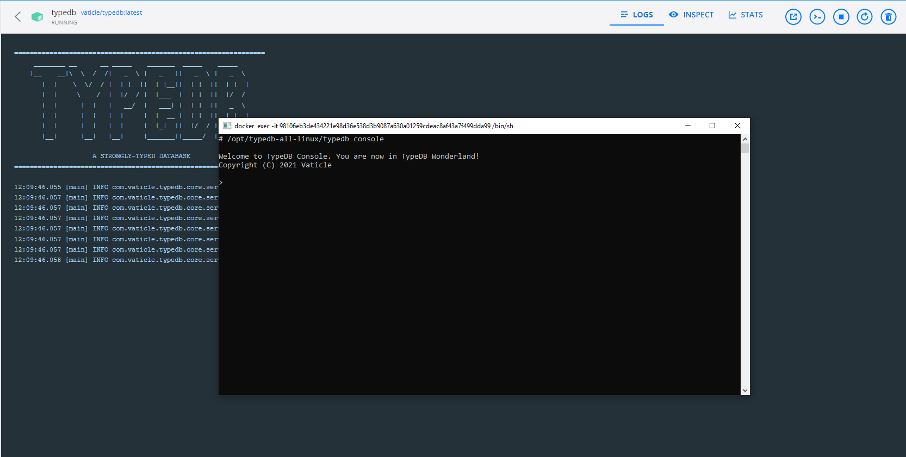

# TypeDB

## Avec docker directement

En étant dans le répertoire `typedb-single`.

```
docker run --name typedb -d -v ./typedb/data:/typedb-all-linux/server/data/ -p 1729:1729 vaticle/typedb:latest
```

## Avec docker compose

### Lancement du conteneur

Pour lancer l'instance TypeDB avec _docker compose_ :

```
docker compose -f dc-typedb-single.yml up -d
```

En ouvrant un shell sur le conteneur, on peut essayer de se connecter à MariaDB pour voir si tout est opérationnel : `/opt/typedb-all-linux/typedb console`



### Arrêt du conteneur

Pour arrêter le conteneur et la base :

```
docker compose -f dc-typedb-single.yml down
```

## Clients

### CLI

**TODO**

### Clients lourds

**TODO**

## Ressources

[Documentation officielle](https://docs.vaticle.com/docs/general/introduction) depuis le [site officiel de TypeDB](https://vaticle.com/).
