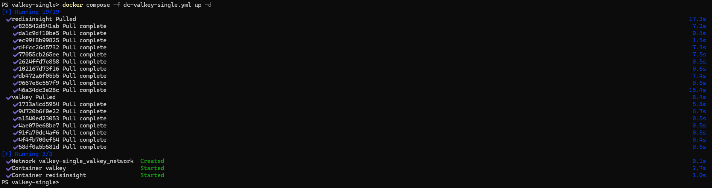
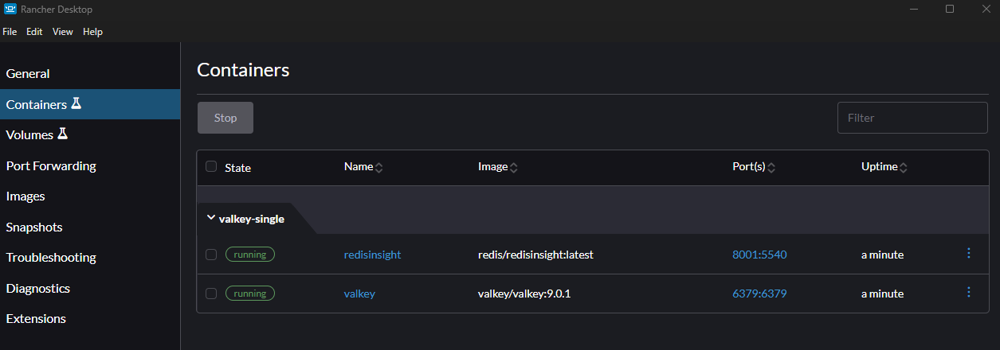
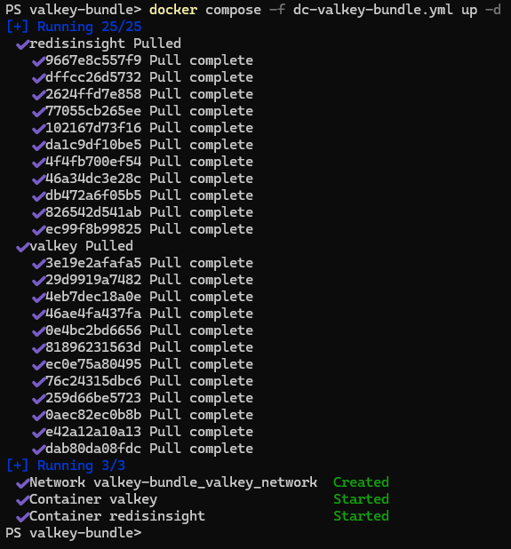
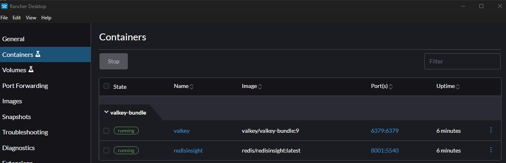
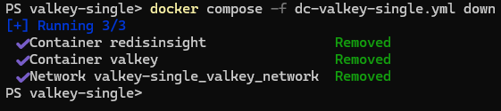
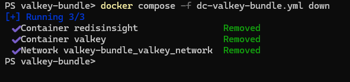

# Docker Compose for Valkey

This [small project](https://github.com/TGITS/docker-compose-examples/tree/main/valkey-docker-compose-examples) provides _docker compose files_ and a minimalist directory structure that creates a local environment for the [Valkey](https://valkey.io/) database to be used for development and experimentation.
Do not use this directly in a production enviroment or at your own risk !

Two _docker compose files_ are provided respectively for Valkey and [Valkey Bundle](https://valkey.io/topics/valkey-bundle/).
Valkey Bundle is a version of Valkey, enhanced with modules like [Valkey JSON](https://github.com/valkey-io/valkey-json), [Valkey Bloom](https://github.com/valkey-io/valkey-bloom), [Valkey Search](https://github.com/valkey-io/valkey-search), and [Valkey LDAP](https://github.com/valkey-io/valkey-ldap).
As such, it allows you to utilize advanced data structures and search capabilities alongside standard Valkey functionality.

In each  two applications are provided by the _docker compose file_:

* A Valkey (single) instance
* [Redis Insight](https://redis.io/insight/) which is a Redis database tool for Redis but compatible with Valkey.

Valkey is originally an open source fork of [Redis](https://redis.io/) and as such it can be accessed with tool as [Redis Insight](https://redis.io/insight/).

This project has been developed and tested under Windows 11 Professional with [Docker](https://www.docker.com/) and [Rancher Desktop](https://rancherdesktop.io/). However it should work on Windows, MacOs and Linux, with directly [Docker](https://www.docker.com/) or [Docker Desktop](https://www.docker.com/products/docker-desktop/).

In all cases you need to have a container engine compatible with `docker` and `docker compose` available in the command line.

On the container with the [Valkey](https://valkey.io/) database engine, there is also [Valkey CLI](https://valkey.io/topics/cli/).

## Running the containers with the Valkey instance

### Valkey

To run the containers and the associated **Valkey** instance with `docker compose`, open a shell, go to the `valkey-docker-compose-examples/valkey-single` directory and run the following command :

```shell
docker compose -f dc-valkey-single.yml up -d
```

If you are on Windows, you can use WSL or if you have the docker engine installed (via Docker Desktop or Rancher Desktop) you can use Windows Powershell.





### Valkey Bundle

To run the container associated with this instance with `docker compose`, open a shell, go to the `redis-docker-compose-examples/valkey-bundle` directory and run the following command :

```shell
docker compose -f dc-valkey-bundle.yml up -d
```





## Accessing Valkey with the CLI in the container

In a shell, after running one of the 2 docker compose files, run the following command line : `docker exec -it valkey /bin/sh`.
You are now in a shell in the container.
Then type `valkey-cli`.
You can now type Valkey command. For example `KEYS *` which output the list of keys with any name in the base. In this empty database, there should be none.
Or maybe you can try `INFO modules` which will list the modules available with your instance.
You can type `quit` to exit `valkey-cli` and of course `exit` to exit the shell if need be.


## Accessing Valkey from the Redis Insight Web Interface

[Redis Insight](https://redis.io/insight/) is available as a Web Application and as a Desktop client. 
In this paragraph we demonstrate the use of the Web Application deployed as a container along side the Valkey instance itself.
You have to connect to the url `http:\\localhost:8001` with your favorite browser.

On your first connexion you will be welcomed with some questions about the privacy settings.


After answering them, you will access the tool in itself.


In the case of the Docker Compose file with **Redis Community** and **Redis Insight**, as you can see on the previous screenshot, the instance is pre-configured with a database on `localhost:6379`.
You can see that the hostname, is `redis`, this the host name defined in Docker Compose : the instance of Redis Insight is on the _same network_ in docker as Redis, and can access it directly with its defined hostname.

If you wish, you can edit the alias of the database.


You can know click on the local database (with alias `redis:6379` on the screenshot - the alias has not been changed in the previous step) to access this base.


The base is empty so there is not much to display.
You land on the _Browser_ page but with the button on the left you can now access the _Workbench_ or the _Analysis Tool_ for example.


You can also install the desktop client which is an Electron app and works in a similar way.
The only attention point is for the Valkey instance host : it should be `127.0.0.1` or `localhost`, as you access the instance from _outside docker_ and not `redis`.

**Redis Insight** offers to load sample data in Redis, but it also works with Valkey.


If you want to experiment with Valkey but do not readily have available data it is a good way to start.


## Stopping the container

To stop the container, type the following in the shell, from the directory which contains your docker compose file 

* for the `dc-valkey-single.yml` docker compose file:

```shell
docker compose -f dc-valkey-single.yml down
```



* for the `dc-valkey-bundle.yml.yml` docker compose file:

```shell
docker compose -f dc-valkey-bundle.yml down
```



## Accessing the Valkey instance with Another Redis Desktop Manager

There is at least another alternative for a desktop client : [Another Redis Desktop Manager](https://goanother.com/).
You can download [the binary from GitHub](https://github.com/qishibo/AnotherRedisDesktopManager/releases).
The installation is quite straightforward and you can only get a zip archive.

When you run the executable for the first time, a window similar to the following screenshot should open. 


When you click on the button `New Connection` on the left-side top corner, a new window should open.
In this new window you can enter the settings for this new connection.
To connect to the dockerised local instance, you will note that the host should be `127.0.0.1` or `localhost`, as you access the instance from _outside docker_ so to speak. As such the host is not `valkey` as it was for the dockerised Redis Insight.


After clicking on the `OK` button, the new connection is now available.
When selecting it, you can now access to the Redis instance.


## Accessing the Valkey instance with the Redis Plugin for Visual Studio Code

There is also an [official Visual Studio Code Plugin](https://redis.io/docs/latest/develop/tools/redis-for-vscode/) for Redis that you can use with Valkey.

On the first execution of the plugin you will have to answer some questions about the privacy settings.


After configuring this settings to your liking, you should access a _welcome screen_.


When clicking on the link `+ Connect your database`, you access a form to enter the parameters of the connection.
As for [Another Redis Desktop Manager](https://goanother.com/), to connect to the dockerised local instance, the host should be `127.0.0.1` or `localhost`, as you access the instance form _outside docker_.


You can now access your Redis instance directly from [Visual Studio Code](https://code.visualstudio.com/).


## Ressources

* [Valkey](https://valkey.io/)
* [Valkey - GitHub](https://github.com/valkey-io/valkey)
* [Valkey - DockerHub](https://hub.docker.com/r/valkey/valkey)
* [Valkey Bundle](https://valkey.io/topics/valkey-bundle/)
* [Valkey Bundle - GitHub](https://github.com/valkey-io/valkey-bundle)
* [Valkey Bundle - DockerHub](https://hub.docker.com/r/valkey/valkey-bundle)
* [Valkey CLI](https://valkey.io/topics/cli/)
* [Official Redis Insight Docker Image](https://hub.docker.com/r/redis/RedisInsight)
* [Another Redis Desktop Manager](https://goanother.com/)
  * [GitHub](https://github.com/qishibo/AnotherRedisDesktopManager)
  * [Releases](https://github.com/qishibo/AnotherRedisDesktopManager/releases)
